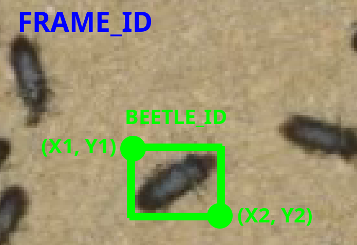

# Beetle Tracker – Tenebrio Molitor

#### Authors:
- Dalibor Kříčka
- Jakub Pekárek
- Pavel Osinek


**2025**  
**Brno University of Technology, Faculty of Information Technology**

---

## Abstract
This work addresses the problem of tracking many beetles in top-down view video recordings, specifically Tenebrio molitor species. The objective was to develop a tool for long-term tracking of individual beetles, emphasizing maintaining consistent identities across frames. An annotated dataset was prepared to support this goal, and a YOLOv11m detection model was fine-tuned. The system integrates the ByteTrack and BoT-SORT tracking algorithms, which were selected for efficiency and accuracy. The resulting solution enables automated beetle movement and behavior analysis, providing valuable data for biological research based on video recordings.


https://github.com/user-attachments/assets/af037b47-c1bf-4f78-8db7-c63bea533c56


## Installation

Install necessary modules in this order: 

### 1. Install Ultralytics

```
pip install ultralytics
```

### 2. Install OpenCV

``` 
pip install opencv-python
```

Or for a headless version:

``` 
pip install opencv-python-headless
```

## Usage
The script `beetle_tracker.py` loads a pre-trained detection model and begins tracking beetle trajectories using the selected algorithm on the chosen video. 

You can view the current bounding boxes and beetle trajectories using GUI (--show). It's also possible to save this output as a video (--save_video). The primary use is the ability to output trajectories in JSON format.

### Launch:
```
beetle_tracker.py [-h] -v VIDEO [-o OUTPUT] -m MODEL [--show] [--save_video SAVE_VIDEO] [--track_length TRACK_LENGTH] [--botsort] [--bytetrack]

Options:

  -h, --help                    show program's help message and exit
  -v VIDEO, --video VIDEO       path to the input video
  -o OUTPUT, --output OUTPUT    save beetle trajectories to the selected folder in JSON format
  -m MODEL, --model MODEL       path to the detection model
  --show                        display a window with detected beetles and their trajectories during runtime
  --save_video SAVE_VIDEO       save video with bounding boxes and trajectories to the selected folder
  --track_length TRACK_LENGTH   change the displayed length of beetle trajectories, default value is 300 frames
  --botsort                     select BotSort tracker
  --bytetrack                   select ByteTrack tracker
```

### GUI Control:
```
Keys:
  Q       shuts down the application if --show was selected, correctly saves output files
  Ctrl-C  shuts down the application, correctly saves output files
```

## Dataset
The dataset consists of beetle annotation for detecting and tracking ground truth for selected beetles. The original videos from which the dataset was made can be found [here](https://drive.google.com/drive/folders/1AGtzvynBpuv33AhRac9ugMWajBD0TyCq?usp=sharing).

### Detection

The dataset is available in directory `\dataset\dataset_detection`. It contains pairs of images (.jpg) and labels (.txt) with the same names. Label files are provided in [Ultralytics YOLO format](https://docs.ultralytics.com/datasets/detect/). Also, the dataset is split into two parts:
- Training dataset,
- Validation dataset.

The mentioned pairs can be arbitrarily transferred between those datasets as needed when training a detection model.

### Tracking

# TODO?

## Detection model
The `model.pt` model is a fine-tuned YOLOv11m detection model for the specified dataset and is provided for the tracking algorithms (see the program argument `--model` under the `Usage` section).

## Tracker Output
The output of the script is a JSON file that holds data on individual beetle trajectories (Multi-Object Tracking results). This JSON file can be further processed for subsequent analysis of the trajectories.

### Structure of the JSON File


```
{
    "FRAME_ID": {
        "BEETLE_ID": [
            [ X1, Y1, X2, Y2 ]
        ],
        ...
    },
    ...
}
```
  
  
#### Description of Each Level
  
| Level              | Data Type         | Meaning                                                                 |
|--------------------|-------------------|-------------------------------------------------------------------------|
| `FRAME_ID`         | `string` (numeric key) | ID of the frame in the image or video sequence. Each key represents a single time step. |
| `BEETLE_ID`        | `string` (numeric key) | ID of the tracked object (e.g., a beetle) within that frame.           |
| `[X1, Y1, X2, Y2]` | `array` of floats  | Coordinates of the bounding box: <br>– `X1, Y1`: top-left corner <br>– `X2, Y2`: bottom-right corner |

<p>&nbsp;</p>
<p align="center">
  
</p>


#### Structure Characteristics

- Each `FRAME_ID` contains all objects visible in that frame.
- Each `BEETLE_ID` is mapped to one bounding box.
- Coordinates are `pixel-based` and typically relative to the image or video `resolution`.


#### Example

```
{
    "0": {
        "1": [
            [ 1247.24, 1147.96, 1270.38, 1175.41 ]
        ],
        "2": [
            [ 1631.59, 461.49, 1660.11, 483.56 ]
        ]
    },
    "1": {
        "1": [
            [ 1246.88, 1147.87, 1270.33, 1175.69 ]
        ],
        "2": [
            [ 1632.11, 461.59, 1660.98, 483.92 ]
        ]
    }
}
```

This means:

- In frame 1, there is an object with ID 2.
- Its bounding box is:
   - top-left: (1632.11, 461.59)
   - bottom-right: (1660.98, 483.92)

## License

This project is licensed under the [GNU Affero General Public License v3.0 (AGPL-3.0)](https://www.gnu.org/licenses/agpl-3.0.html).

It uses the [Ultralytics YOLO](https://www.ultralytics.com/yolo) library, which is also licensed under AGPL-3.0, and [OpenCV](https://opencv.org/), which is licensed under the Apache 2.0 License.

In accordance with the AGPL-3.0 license terms, the full source code of this project is publicly available.
